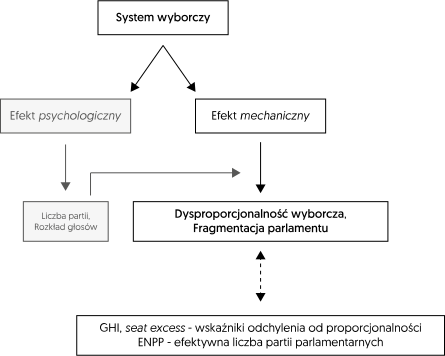
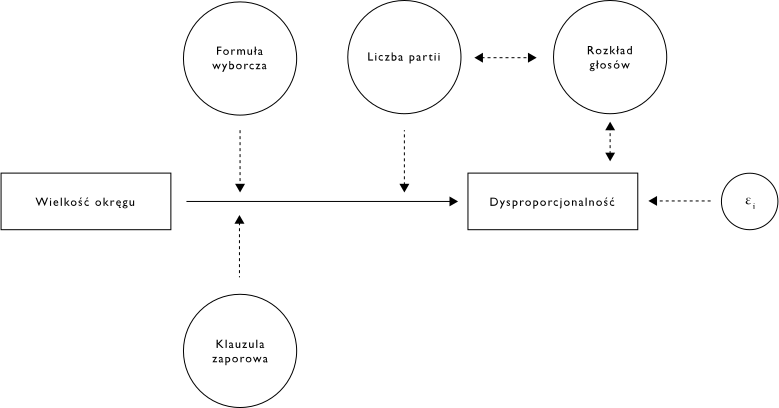
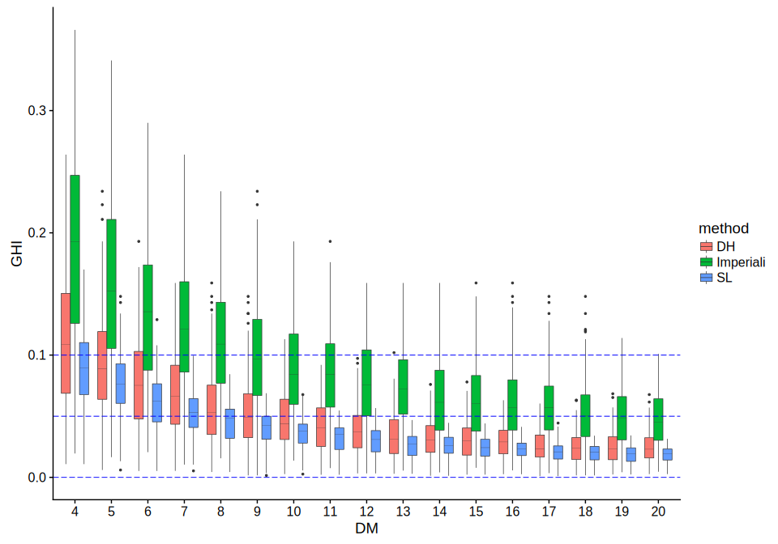
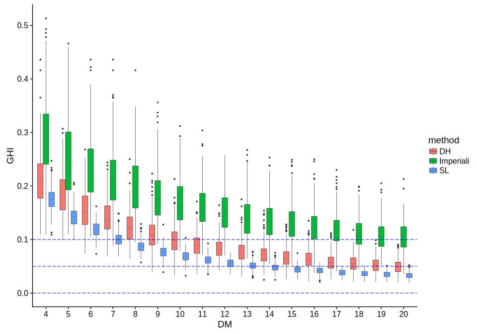
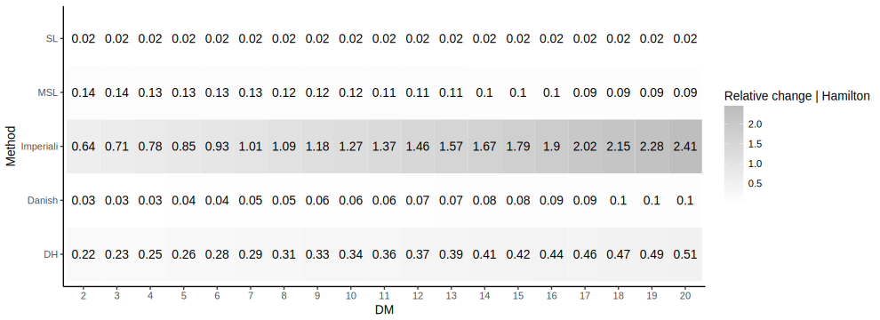
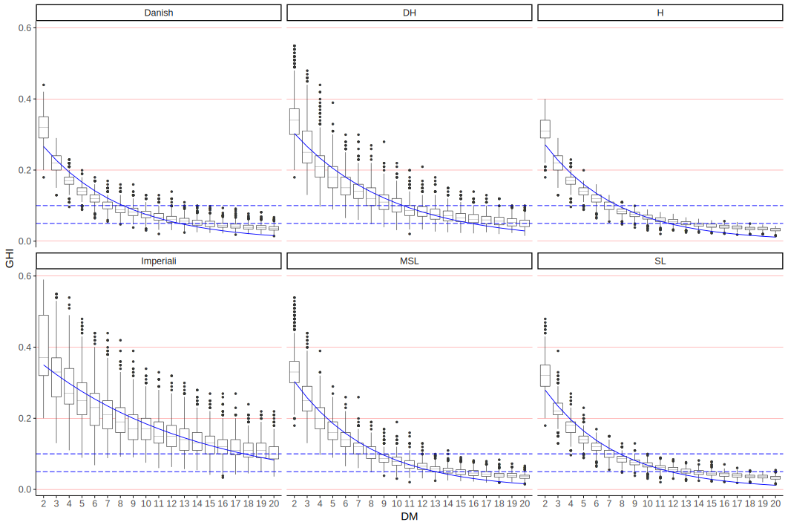
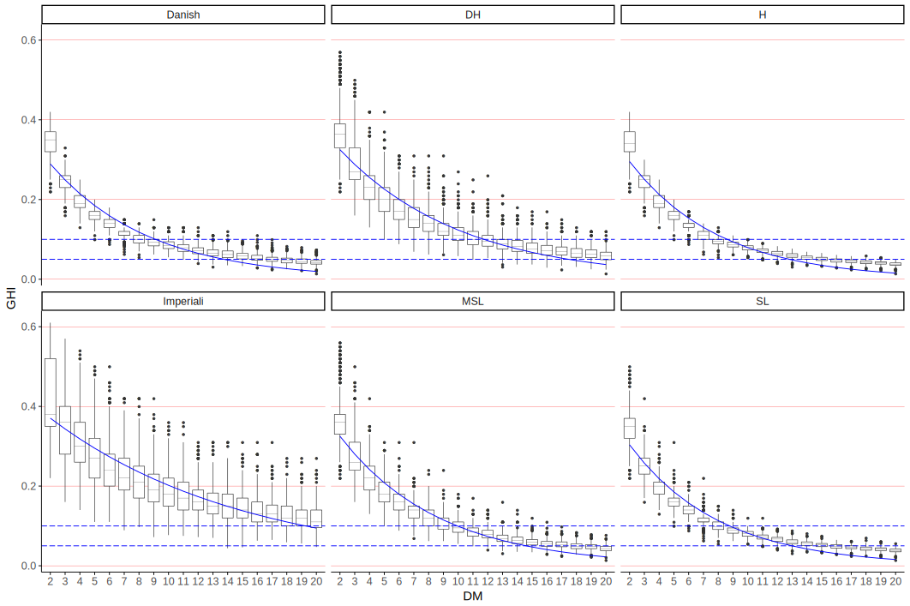
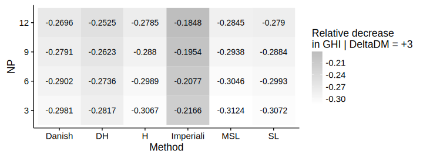
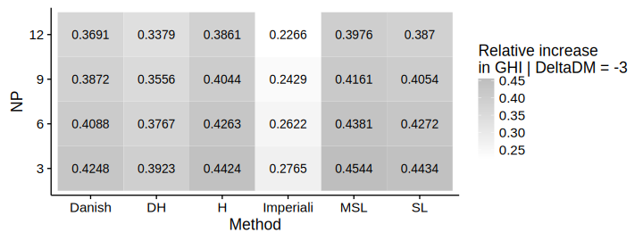

# Uwagi dotyczące stanu badań

## Uwagi dotyczące stanu badań

Efekty *mechaniczne* i *psychologiczne* procedur wyborczych były wcześniej przedmiotem szczegółowych badań politologów, socjologów oraz matematyków.

Jeżeli chodzi o badania **politologów** i **socjologów**, to oparte były one na danych pochodzących z prawdziwych elekcji.

Analizę efektów *mechanicznych* i *psychologicznych*, w tym replikację wcześniejszych badań, można przeprowadzić wykorzystując dane z **symulacji komputerowych**.

## Efekty mechaniczne

## Równoważenie *wyborczej dysproporcjonalności* i *fragmentacji parlamentu*

Liczne badania *mechanicznych* i *psychologicznych* efektów procedur wyborczych dotyczyły wpływu systemu wyborczego na:

- dysproporcjonalność wyborczą,
- poziom fragmentacji parlamentarnego systemu partyjnego.

## Symulacja komputerowa w badaniach wyborczych

Metoda symulacyjna umożliwia *replikację* ważnych, ale czasami dyskusyjnych, badań:

- Benoit, K. (2000). *Which Electoral Formula Is the Most Proportional? A New Look with New Evidence*. Political Analysis;
- Carey, J. M., & Hix, S. (2011). *The Electoral Sweet Spot: Low-Magnitude Proportional Electoral Systems*. American Journal of Political Science.

## Symulacja komputerowa w badaniach wyborczych (2)

Wykorzystując symulację komputerową *Monte Carlo*, można m.in. badać **'czysto'** *mechaniczny* wpływ:

- formuły wyborczej,
- wielkości okręgu wyborczego,

na poziom **dysproporcjonalności** wyborczej.

## Symulacja komputerowa w badaniach wyborczych (3)

**Metoda symulacyjna** umożliwia **wyizolowanie** wpływu na *dysproporcjonalność* wyborczą lub *fragmentację* parlamentu pojedynczego czynnika (np. wielkość okręgów wyborczych) - założenie *ceteris paribus*.

Stosując symulację komputerową można dość łatwo *kontrolować* istotne zmienne moderujące, takie jak:

- liczba partii rywalizujących w okręgu,
- rozkład głosów w okręgu.

## Dysproporcjonalność ~ *DM*

## Przykład

W badaniu Carey i Hixa (2011), autorzy przewartościowują znaczenie ..., ponieważ ...

## Symulacja komputerowa w badaniach wyborczych (4)

Symulacja komputerowa pozwala odseparować *czysto* mechaniczne efekty systemu wyborczego od tzw. efektów psychologicznych.

## Symulacja komputerowa w badaniach wyborczych (5)

Efekt *psychologiczny* odzwierciedlają:

- ustalona liczba $l$ rywalizujących w okręgu partii politycznych,
- kształt krzywej *funkcji gęstości rozkładu prawdopodobieństwa*, która wykorzystywana jest do losowania próby zawierającej głosy oddane na $l$ partii politycznych w $n$ elekcjach.

## Podstawowe zalety metody symulacyjnej

- pozwala na przeprowadzenie złożonej analizy *mechanicznych* efektów systemów reprezentacji proporcjonalnej (uwzględnienie różnorodnych kombinacji formuły wyborczej, wielkości okręgów, klauzuli zaporowej oraz liczby konkurujących w okręgu partii);
- umożliwia odseparowanie efektów *mechanicznych* od efektów *psychologicznych* systemu;
- pozwala badając efekt jednej zmiennej utrzymać pozostałe zmienne na stałym poziomie (*ceteris paribus*);
- daje możliwość łatwej replikacji lub reprodukcji badania.

## Podstawowe zalety metody symulacyjnej (2)

Symulacja komputerowa pozwala na precyzyjne prognozowanie:

- odchyleń od proporcjonalności,
- liczby partii parlamentarnych,
- nadwyżki zwycięzcy itp.,

dla różnorodnych konfiguracji parametrów systemu wyborczego. W tym tych konfiguracji, które empirycznie nie były stosowane.

## Pytania szczegółowe (1)

- Czy istnieje optymalna kombinacja wielkości okręgu wyborczego oraz formuły wyborczej, która zapewnia równowagę między dysproporcjonalnością wyborczą i poziomem fragmentacji parlamentarnego systemu partyjnego (*electoral sweet-spot*)? Czy małe okręgi (4-8) są najlepsze? (Carey & Hix, 2011)

## Pytania szczegółowe (2)

- Jak na proporcję głosów najmniejszej partii uzyskującej mandaty wpływają różne konfiguracje formuły wyborczej, wielkości okręgów i klauzuli zaporowej?

- Jak wpływają różne konfiguracje parametrów systemów reprezentacji proporcjonalnej na wysokość tzw. *nadwyżki partii zwycięskiej* (*seat excess* dla partii zwycięskiej)?

# Symulator

## Projekt aplikacji

Aplikacja komputerowa zaprojektowana z użyciem języka programowania **R**:
- pakiet *disprr* - wersja *alpha*;
- wersja online (aplikacja w technologii *Shiny*):
https://polisci.shinyapps.io/disproportionality_of_apportionment_methods/

## Podstawowe cechy symulacji

Proces symulacji przebiega na dwóch podstawowych etapach:

## I etap - stochastyczny

Symulator generuje *n* wektorów głosów ważnych, oddanych w okręgach, na *l* partii politycznych rywalizujących o głosy na poziomie okręgu wyborczego, w którym zdobyć można $TS$ mandatów. Głosy oddane na partie losowane są np. z uciętego rozkładu *log-normalnego*: $$v_i \sim lnN(\mu, \sigma, min = a, max = b)$$

## II etap - deterministyczny

Symulator wykonuje operacje podziału dostępnych w okręgach mandatów między *l* partii politycznych, z użyciem ustalonych metod alokacji.

## Przykładowe ustawienia symulacji

Zbiór danych z symulatora zawiera:

- wektory głosów dla $l = \{3, 6, 9, 12\}$ partii, wylosowane z rozkładu log-normalnego (dla zmiennych parametrów),
- [dla] $n = 500$ elekcji (zakłada się istnienie 1 okręgu narodowego),
- [w] okręgach o wielkości od 2 do 20 mandatów.

Dla wskazanych ustawień zbiór danych zawiera $4 \times 500 \times 19$ = **38 000** elekcji.

# Analiza danych z symulacji

## Modele: Dysproporcjonalność ~ Wielkość okręgu

- Model **wykładniczy**:

$$GHI(DM_i) = Ce^{\alpha \times DM_i} + \epsilon_i$$

- Model **log-liniowy**:

$$ ln(GHI_i) = \beta_0 + \beta_1 \times DM_i + \beta_2 \times method_i + \beta_3 \times NP_i + \\ + \beta_4 \times DM_i \times method_i + \beta_5 \times DM_i \times NP_i + \epsilon_i $$

## Wizualizacja: Dysproporcjonalność ~ DM | 3

## Wizualizacja: Dysproporcjonalność ~ DM | 9

# Pytania

## Pytania (1)

1. Jakie są krańcowe efekty (*marginal effects*):

- metod alokacji mandatów {np. *D'Hondt*} i
- wielkości okręgów wyborczych,

względem wyborczej dysproporcjonalności?

## Pytania (2)

2. Jak zmienia się poziom wyborczej dysproporcjonalności mierzony GHI, gdy:

- zmieniamy metodę alokacji z *Hamiltona* na metodę (np.) *D'Hondta*,
- zwiększamy/zmniejszamy wielkość okręgu o jednostkę ($\Delta DM = 1$)?

3. Który z parametrów (formuła wyborcza, wielkość okręgu) wpływa silniej na poziom odchylenia od proporcjonalności mierzony wskaźnikiem GHI?

# Wyniki

## Wyniki

Uzyskane wartości liczbowe zostały wyznaczone na podstawie *modeli regresyjnych*, których parametry oszacowano z użyciem danych z symulacji *Monte Carlo*.

## Konfiguracje parametrów systemu generujące dysproporcjonalność w przedziale [0.05, 0.1]

Liczba partii | DH | SL | HA Imperiali
-|-|-|-
3                     | [[5.64], [9.45]]   | [[4.51], [7.80]]  | [[9.93], [16.06]]
6                     | [[8.69], [13.31]]  | [[6.61], [10.20]] | [[14.79], [22.40]]
9                     | [[10.47], [15.76]] | [[7.82], [11.73]] | [[17.70], [26.36]]
12                    | [[11.76], [17.499]] | [[8.79], [13.02]] | [[19.22], [28.34]]

## Efekty krańcowe (1)

## Efekty krańcowe (2)

**Efekty krańcowe** zmiany wielkość okręgów ($\Delta DM = 1$) względem dysproporcjonalności (wartości wyznaczone na podstawie *nieliniowego modelu wykładniczego*).

| - | Danish | DH     | H | Imperiali | MSL    | SL
-|-|-|-|-|-|-|
3 partie  | -0.202 | -0.180 | -0.211   | -0.112    | -0.229 | -0.209
6 partii  | -0.173 | -0.150 | -0.193   | -0.091    | -0.191 | -0.192
9 partii | -0.156 | -0.131 | -0.176   | -0.080    | -0.164 | -0.176
12 partii | -0.150 | -0.121 | -0.164   | -0.076    | -0.148 | -0.164

## Efekty krańcowe (3a)

## Efekty krańcowe (3b)

## Efekty krańcowe (4a)

Dla $\Delta DM = 3$ lub $-3$

## Efekty krańcowe (4b)

Dla $\Delta DM = 3$ lub $-3$

## Podstawowe wnioski (1)

1. Na przykład, dla metody *d’Hondta* i 6-partyjnego systemu, jeśli wielkość okręgu zmniejszy się o trzy mandaty, oczekiwana agregatowa dysproporcjonalność (GHI) - *ceteris paribus* - wzrośnie o ok. $38\%$.

## Podstawowe wnioski (2)

2. Zamiana metody **Hamiltona** na formułę **d’Hondta** powoduje, przeciętnie, w przybliżeniu $36\%$ wzrost dysproporcjonalności (GHI), w przedziale $2-20$ mandatów na okręg.

## Podstawowe wnioski (3)

3. Ogólnie, badanie wskazuje, że zmiana formuły wyborczej (np. z **Hamiltona** na **d’Hondta**) ma mniejszy wpływ na poziom dysproporcjonalności wyborczej, w porównaniu do wpływu zmiany wielkości okręgu wyborczego (co najmniej o **3** mandaty).

# Dziękuję
